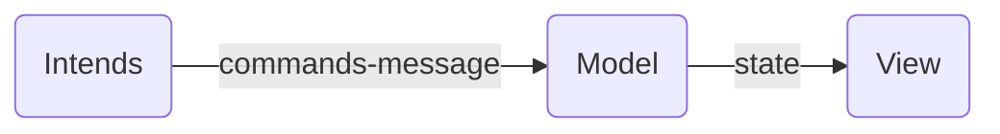
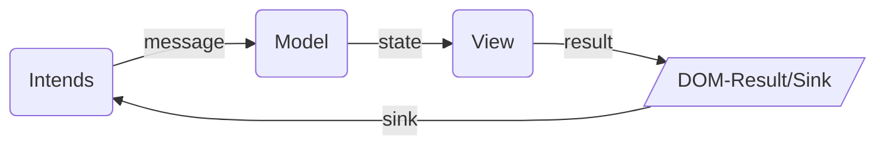

# UI architecture

## MV*

### Overview

State is not the Model

### Principles
  - [KISS, keep it small and simple](https://www.wikiwand.com/en/KISS_principle)
  - [Simple things should be simple, complex things should be possible](https://www.wikiwand.com/en/Alan_Kay)
  - Composable
  - Refactorable
  - Scalable
  - Use the platform

## Concepts

- [UI = view(application_state)](https://medium.com/@mweststrate/pure-rendering-in-the-light-of-time-and-state-4b537d8d40b1)

### MVU

 - [Elm architecture](https://guide.elm-lang.org/architecture/)
     - [Elm Example](https://software.garden/day-5.html)
     - [Elmish](https://elmish.github.io/elmish/)

 - [flutter](https://medium.com/flutter-community/flutter-and-dartea-create-mobile-application-with-pleasure-c1866ff2b4d4)
     - [dartea](https://github.com/p69/dartea)
 - [apprun](https://github.com/yysun/apprun)
 - [dotnet-websharper](https://github.com/dotnet-websharper/mvu)
 - [Debug tool](https://github.com/zalmoxisus/remotedev)
 
 
### MVI

### Principles

From https://cycle.js.org/model-view-intent.html

- intent() `function`
  - Purpose: interpret DOM events as user’s intended actions
  - Input: DOM source
  - Output: Action Streams

- model() `function`
  - Purpose: manage state
  - Input: Action Streams
  - Output: State Stream

- view() `function`
  - Purpose: visually represent state from the Model
  - Input: State Stream
  - Output: Stream of Virtual DOM nodes as the DOM Driver sink

### Videos
  - [What if the user was a function? by Andre Staltz at JSConf Budapest 2015](https://www.youtube.com/watch?v=1zj7M1LnJV4)
   - [slides](https://speakerdeck.com/staltz/what-if-the-user-was-a-function)

### References
   - [REACTIVE APPS WITH MODEL-VIEW-INTENT](http://hannesdorfmann.com/android/mosby3-mvi-1)
   - [MVI(Model-View-Intent) Pattern in Android](https://medium.com/code-yoga/mvi-model-view-intent-pattern-in-android-98c143d1ee7c)
   - [Model-View-Intent by cycle.js](https://cycle.js.org/model-view-intent.html)

## Event streams

  - [bacon.js](https://baconjs.github.io/)
  - [RxJS](https://github.com/ReactiveX/RxJS)
  - [xstream](http://staltz.github.io/xstream/)
  - [most](https://github.com/cujojs/most/)

  - [cycle.js](https://cycle.js.org/)

## States

### Library

  - [redux](https://redux.js.org/)

  - [Mobx](https://mobx.js.org/README.html)

  - [mobx-state-tree](https://mobx-state-tree.js.org/intro/philosophy)

  - [freezer](https://github.com/arqex/freezer)

  - [Cerebral.js](https://cerebraljs.com/)

### Tools

  - [remotedev](https://github.com/zalmoxisus/remotedev)

## Performance

- [Benchmarks](https://stefankrause.net/js-frameworks-benchmark8/table.html)
- [React optimization](https://medium.com/@paularmstrong/twitter-lite-and-high-performance-react-progressive-web-apps-at-scale-d28a00e780a3)
- [React fiber](https://github.com/acdlite/react-fiber-architecture)
  - [A Cartoon Intro to Fiber ](https://www.youtube.com/watch?v=ZCuYPiUIONs)

#### Library

### DOM updater

- [lit-html](https://github.com/Polymer/lit-html)
    - [lit-HTML (Chrome Dev Summit 2017)](https://www.youtube.com/watch?v=Io6JjgckHbg)

- [lighterhtml](https://github.com/WebReflection/lighterhtml)
    - https://medium.com/@WebReflection/lit-html-vs-hyperhtml-vs-lighterhtml-c084abfe1285

- [maquette.js](https://maquettejs.org/)

- [redom](https://redom.js.org/)

- [DomVm](https://github.com/domvm/domvm)

- [snabbdom](https://github.com/snabbdom/snabbdom)

- [hyperdom](https://hyperdom.org/#/)

- [simulacra.js](https://simulacra.js.org/)

- [Binding.scala](https://github.com/ThoughtWorksInc/Binding.scala)

- [petit-dom](https://github.com/yelouafi/petit-dom)

- [vidom](https://github.com/dfilatov/vidom)

### Full

 - [ractive](https://github.com/ractivejs/ractive)
 
 - [apprun](https://github.com/yysun/apprun)
 
 - [dojo](https://dojo.io/)

- [cycle.js](https://cycle.js.org/)
 
 - [svelte](https://github.com/sveltejs/svelte)

## Standards

### Web Components

- [Web Components](https://developer.mozilla.org/en-US/docs/Web/Web_Components)
    - [Building Components - google](https://developers.google.com/web/fundamentals/web-components)
    - [custom elements](https://www.html5rocks.com/en/tutorials/webcomponents/customelements/)

- [stencil js](https://stenciljs.com/)

- [lit-element](https://lit-element.polymer-project.org/)

## Others

### Videos

- [Angular, React, Vue and Co: Web Components and Mini Apps](https://www.youtube.com/watch?v=QGo_EBjCoyI)

### Routers

- [navigo](https://github.com/krasimir/navigo)
